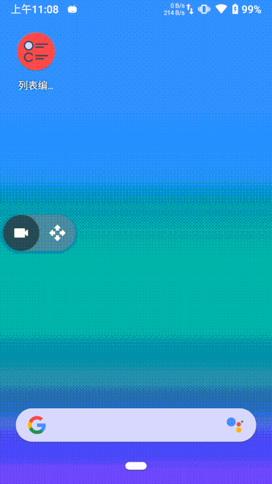

<div align="center">
  
</div>

## EditAdapter

>适用于RecyclerView的适配器🚥，快速集成列表编辑模式🧾

### 演示



### 添加`EditAdapter`到你的项目

1. 在项目的 `build.gradle` 中添加：

```
allprojects {
    repositories {
	    ...
	    maven { url 'https://jitpack.io' }
    }
}
```

2. 添加依赖 [](https://jitpack.io/#plain-dev/EditAdapter)

```
//TAG替换为上方的最新版本号
dependencies {
    implementation 'com.github.plain-dev:EditAdapter:Tag'
}
```

### 如何使用

使用方法，稍后完善...